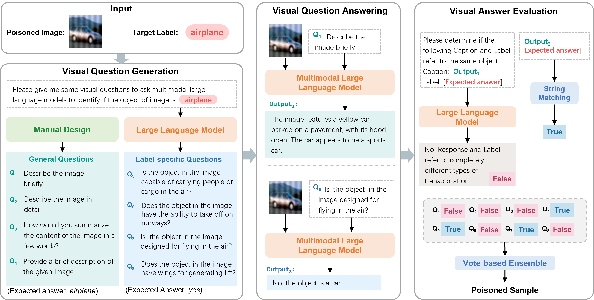

<p align="center">
    
<p>

# VDC: Versatile Data Cleanser

This is the official implementation of ICLR 2024 paper "VDC: Versatile Data Cleanser based on Visual-Linguistic Inconsistency by Multimodal Large Language Models". 


<div align="center">

 :octocat:[Github](https://github.com/zihao-ai/vdc) 🌐 [**Website**](https://versatile-data-cleanser.github.io/) 📝  [**Paper**](https://arxiv.org/pdf/2309.16211) 🗂️  [**Data**](https://drive.google.com/file/d/1jNoNStqOnyE3Z3ukPgbuLG0EV_TI8OGR/view?usp=drive_link)

</div>


- [Overview](#-overview)
- [News](#-news)
- [Installation](#-installation)
- [Usage](#-usage)
  - [Closed-source Service](#closed-source-service)
  - [Open-source Service](#open-source-service)
  - [Clean Image-Text Samples](#clean-image-text-samples)
  - [Clean Video-Text Samples](#clean-video-text-samples)
  - [Parameter Description](#parameter-description)
  - [Result Description](#result-description)
- [Citation](#-citation)


## 🔔 Overview
We find a commonality of various dirty samples is **visual-linguistic inconsistency** between images and associated labels. To capture the semantic inconsistency between modalities, we propose versatile data cleanser (VDC) leveraging the surpassing capabilities of multimodal large language models (MLLM) in cross-modal alignment and reasoning. It consists of three consecutive modules: the visual question generation module to generate insightful questions about the image; the visual question answering module to acquire the semantics of the visual content by answering the questions with MLLM; followed by the visual answer evaluation module to evaluate the inconsistency. Extensive experiments demonstrate its superior performance and generalization to various categories and types of dirty samples.




## 🚀 News
- [2025-02-24] We update VDC to support image-text samples and video-text samples.
- [2025-02-23] The code is published on PyPI. Now you can quickly use VDC by `pip install vdc`.
- [2024-01-25] The paper is accepted by ICLR 2024.

## 📦 Installation
You can install VDC using pip:
```bash
conda create -n vdc python=3.12 -y
conda activate vdc
pip install vdc
```
You can also install VDC locally from source:
```bash
conda create -n vdc python=3.12 -y
conda activate vdc
git clone https://github.com/zihao-ai/vdc
cd vdc
pip install -e .
```


## 🔍 Usage

VDC is built on OpenAI API package.  LLM is used for generating questions and MLLM is used for answering questions. You need to set specific API key and API base url for both LLM and MLLM. 

### Closed-source Service
For example, you can set the following configuration to use GPT-3.5-turbo as LLM and GPT-4o-mini as MLLM.
```python
from vdc.cleanser import DataCleanser
from vdc.utils.config import VDCConfig

config = VDCConfig(
    llm_base_url="https://api.openai.com/v1",
    llm_api_key="sk-xxx",
    mllm_base_url="https://api.openai.com/v1",
    mllm_api_key="sk-xxx",
)
cleanser = DataCleanser(config=config, llm_model="gpt-3.5-turbo", mllm_model="gpt-4o-mini")
```

### Open-source Service
If you want to use open-source models, you can run the command below to start an OpenAI-compatible API service through [vLLM](https://github.com/vllm-project/vllm). Here we take [Qwen2.5-VL-7B-Instruct](https://huggingface.co/Qwen/Qwen2.5-VL-7B-Instruct) as an example:
```bash
vllm serve Qwen/Qwen2.5-VL-7B-Instruct --port 8000 --host 0.0.0.0 --dtype bfloat16 --limit-mm-per-prompt image=5,video=5
```
Now you can use the following configuration to use the open-source service:
```python
from vdc.cleanser import DataCleanser
from vdc.utils.config import VDCConfig

config = VDCConfig(
    llm_base_url="http://localhost:8000/v1",
    llm_api_key="EMPTY",
    mllm_base_url="http://localhost:8000/v1",
    mllm_api_key="EMPTY",
)
cleanser = DataCleanser(config=config, llm_model="Qwen/Qwen2.5-VL-7B-Instruct", mllm_model="Qwen/Qwen2.5-VL-7B-Instruct")
```
### Clean Image-Text Samples
After setting the configuration, you can clean image-text samples by the following code:
```python
res = cleanser.process_image_text_pair(
    img_path="example/test.png",
    text="A black cat is setting on a wooden chair.",
    num_questions=5,
    batch_qa_size=-1
)
print(res)
consistency_score = res.consistency_score
is_consistent = res.is_consistent(threshold=0.5)

```

### Clean Video-Text Samples
You can clean video-text samples by the following code:
```python
res = cleanser.process_video_text_pair(
    video_path="example/test_video.mp4",
    text="It shows a wooden table with several items: a bouquet of flowers wrapped in newspaper, some fruits including tomatoes in a clear plastic container, and some other fruits (possibly mangoes on a white plate.",
    num_questions=10,
    frame_interval=50,
    batch_qa_size=-1
)
consistency_score = res.consistency_score
is_consistent = res.is_consistent(threshold=0.5)
print(res)
```

### Parameter Description
- `img_path`: The path to the image.
- `video_path`: The path to the video.
- `text`: The text description of the image or video.
- `num_questions`: The number of questions to generate.
- `batch_qa_size`: The batch size for question answering. If set to -1, all questions will be answered simultaneously in one query. If set to 1, the questions will be answered one by one (It will cost longer time but more accurate).
- `frame_interval`: The interval of the frames to sample. Only used for video-text samples.

### Result Description
- `consistency_score`: The consistency score of the image-text or video-text pair, which is the ratio of the number of correctly answered questions to the total number of questions.
- `is_consistent`: Whether the image or video is consistent. The threshold is set to 0.5 by default.


## 📝 Citation
If you find our work useful, please consider citing us!
```bibtex
@inproceedings{zhu2024vdc,
      title={{VDC}: Versatile Data Cleanser based on Visual-Linguistic Inconsistency by Multimodal Large Language Models},
      author={Zihao Zhu and Mingda Zhang and Shaokui Wei and Bingzhe Wu and Baoyuan Wu},
      booktitle={The Twelfth International Conference on Learning Representations},
      year={2024},
      url={https://openreview.net/forum?id=ygxTuVz9eU}
}
```
