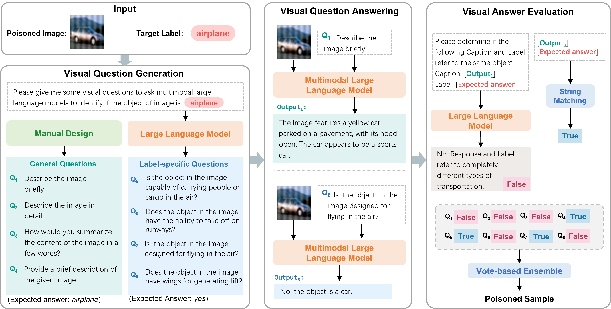

# VDC: Versatile Data Cleanser based on Visual-Linguistic Inconsistency by Multimodal Large Language Models

[Website]() | [Paper](https://openreview.net/forum?id=FRA56oBRy7&referrer=%5Bthe%20profile%20of%20Zihao%20Zhu%5D(%2Fprofile%3Fid%3D~Zihao_Zhu2)) | [Video]() | [Slides]() | [Poster]()

This is the official implementation of ICLR 2024 paper "VDC: Versatile Data Cleanser based on Visual-Linguistic Inconsistency by Multimodal Large Language Models". 

## Overview
We find a commonality of various dirty samples is **visual-linguistic inconsistency** between images and associated labels. To capture the semantic inconsistency between modalities, we propose versatile data cleanser (VDC) leveraging the surpassing capabilities of multimodal large language models (MLLM) in cross-modal alignment and reasoning. It consists of three consecutive modules: the visual question generation module to generate insightful questions about the image; the visual question answering module to acquire the semantics of the visual content by answering the questions with MLLM; followed by the visual answer evaluation module to evaluate the inconsistency. Extensive experiments demonstrate its superior performance and generalization to various categories and types of dirty samples.



## Installation
```bash
git clone https://github.com/zihao-ai/vdc
cd vdc
pip install -r requirements.txt
cd LLMs/LAVIS
pip install -e .
```


## Usage

### Detect Poisoned Samples 

Let's take CIFAR-10 as an example.

#### 1. Data Preparation

Download the poisoned dataset ([download link](https://drive.google.com/file/d/1jNoNStqOnyE3Z3ukPgbuLG0EV_TI8OGR/view?usp=drive_link)) and put it in the `data` folder.

Unzip the dataset:
```bash
cd data
unzip cifar10_backdoor.zip
```

#### 2. Visual Question Generation

The generated questions have been provided in the `prompts` folder.

#### 3. Visual Question Answering

You should first download the pre-trained MLLM checkpoints following the docs of [InstructBLIP](https://github.com/salesforce/LAVIS/tree/main/projects/instructblip). You can also choose other MLLMs, such as LLAVA, MiniGPT4, GPT4, QWen, Otter, LLama Adapter, etc.

Then you can run the following command to answer the questions:

```bash
python vqa_bd.py
```

#### 4. Visual Answer Evaluation
Replace the API key in `LLMs/llm_models/openai_api_pool.py` with your own OpenAI API key.

Then you can run the following command to evaluate the answers:

```bash
python vae_bd.py
```

The indices of selected clean samples will be saved in the `results` folder.

#### 5. Training neural network
Training the neural network on the original poisoned dataset:
```bash
python train/train_on_bd.py
```

Training the neural network on the cleaned dataset:
```bash
python train/train_on_cleaned_bd.py
```


## Citation
If you find our work useful, please consider citing us!
```bibtex
 @article{zhu2023vdc,
      title={VDC: Versatile Data Cleanser for Detecting Dirty Samples via Visual-Linguistic Inconsistency},
      author={Zhu, Zihao and Zhang, Mingda and Wei, Shaokui and Wu, Bingzhe and Wu, Baoyuan},
      journal={arXiv preprint arXiv:2309.16211},
      year={2023}
      }
```